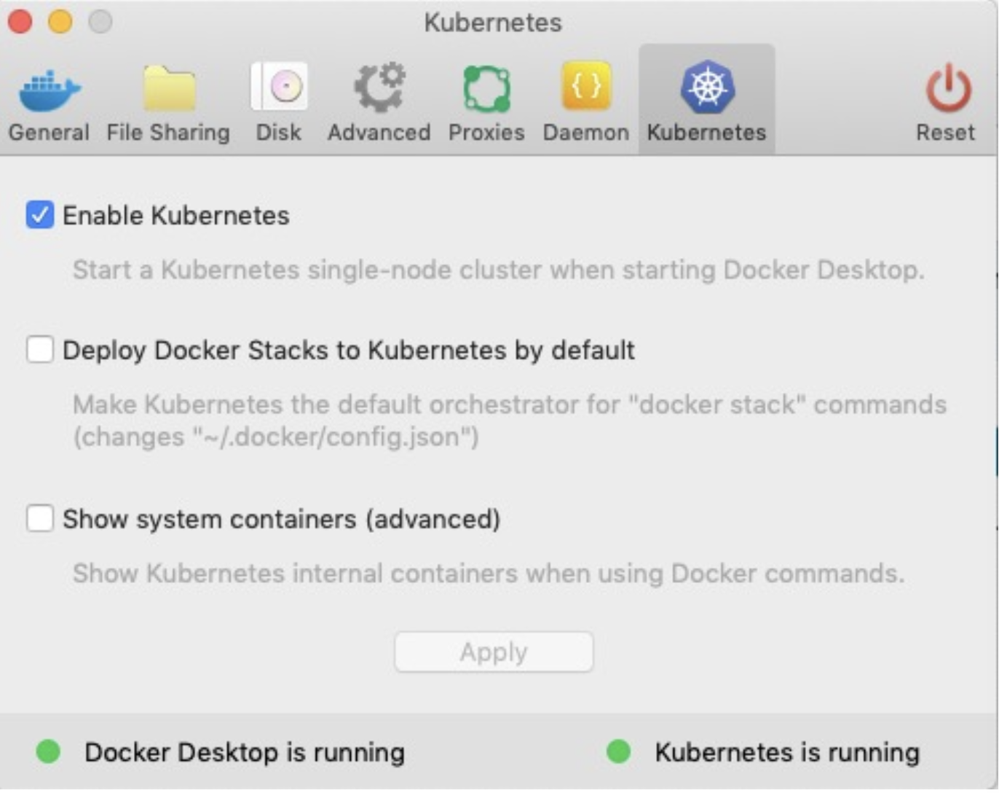

<br>
<br>
<center>

</center>


<!--
The last comment block of each slide will be treated as slide notes. It will be visible and editable in Presenter Mode along with the slide. [Read more in the docs](https://sli.dev/guide/syntax.html#notes)
-->


---
transition: fade-out
---

# Types d’installation

<br>

<div class="grid grid-cols-2">
<div>
<ul style="list-style-type:square;">

## Solutions On-Premise
<li>kubeadm</li>
<li>kubespray</li>
<li>OpenShift (RedHat)</li>
<li>Rancher (SUSE)</li>
<li>Docker EE (Mirantis)</li>
<li>Tanzu (VMware)</li>
<br>

## Solutions hébergées
<li>EKS : Amazon Elastic Kubernetes Service</li>
<li>GKE : Google Kubernetes Engine</li>
<li>AKS : Azure Kubernetes Service</li>
</ul>
</div>

<div>
<ul style="list-style-type:square;">

## Solutions locales
<li>Minikube</li>
<li>Docker Desktop (Mac & Windows & Linux)</li>
<br>

## Environnement de tests
<li>play-with-k8s.com</li>
</ul>
</div>
</div>


---
transition: fade-out
---

# minikube sur un Desktop

<br>

<div class="grid grid-cols-2">
<div>
<ul style="list-style-type:square;">

## Solution tout en un
<li>Locale</li>
<li>Orientée développeur</li>

<br>

## Basée sur une VM
<li>Hyperviseur Host-Based</li>
<li>VirtualBox</li>
<li>Vmware</li>
</ul>
</div>

<div>
<ul style="list-style-type:square;">

## Sur poste de travail
<li>Linux</li>
<li>Windows</li>
<li>Mac</li>
<br>

</ul>
</div>
</div>

---
transition: fade-out
---

# pré-requis minikube

<br>

<div>
<ul style="list-style-type:square;">

## Installer un hyperviseur en local
## Installer le binaire minikube
<li>Linux : https://github.com/kubernetes/minikube</li>
<li>Windows : https://github.com/kubernetes/minikube/minikube-installer.exe</li>
<li>MacOS : https://storage.googleapis.com/minikube/minikube-darwin-amd64</li>
<br>

## Installer le binaire kubectl
<li>https://kubernetes.io/fr/docs/tasks/tools/install-kubectl/</li>
<br>


</ul>
</div>

---
transition: fade-out
---

# Docker Desktop

<br>

<div class="grid grid-cols-2">
<div>
<ul style="list-style-type:square;">

## Basée sur un VM linux avec l’hyperviseur Natif
- Hyper-V à partir de Windows 10 Pro et Entreprise
- Hyperkit (xhyve) à partir de macOS Sierra 10.12
- Qemu sur Desktop Linux (Ubuntu ...)

## Activer Kubernetes comme solution Cluster

</ul>
</div>

<div>
<ul style="list-style-type:square;">



</ul>
</div>
</div>

---
transition: fade-out
---

# kubeadm

<br>

<div>
<ul style="list-style-type:square;">

- Binaire kubeadm installé sur tous les nœuds du Cluster
- Docker ou autre Container Run Time installé

## Master :
```bash
master# kubeadm init
master$ kubectl apply –f https://raw.githubusercontent.com/coreos/kube-flannel.yml
```
<br>

## Worker :
```bash
worker# kubeadm join 192.168.116.160:6443 --token mm20xq.goxx7plwzrx75tv3
```

</ul>
</div>

